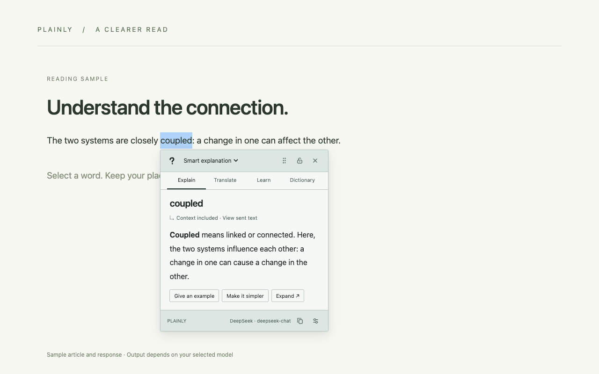

# Plainly · 释义

[中文](README.md) · [Releases](https://github.com/JiaweiZhang1997/plainly/releases) · [Issues](https://github.com/JiaweiZhang1997/plainly/issues)

A Chrome / Edge Manifest V3 extension for explaining selected terms, slang and acronyms with your own LLM API. It also offers translation, same-language learning, dictionary lookup and Jev semantic page search. English and Simplified Chinese interfaces are included.



## Install

Requires **Chrome or Edge 128+**.

1. Download `plainly-<version>-chrome-web-store.zip` from the [latest release](https://github.com/JiaweiZhang1997/plainly/releases/latest) and extract it to a permanent folder.
2. Open `chrome://extensions` or `edge://extensions` and enable **Developer mode**.
3. Choose **Load unpacked** and select the extracted folder containing `manifest.json` directly.
4. Pin Plainly, open **Settings → Models**, select a provider and enter your API key and model ID. Test the connection and **Save changes**.
5. Refresh existing web pages, select text, and click the question mark.

The extension is not yet listed in the Chrome Web Store. GitHub's automatic “Source code” archives must be built before loading.

## Use

- In **Reading**, enable Explain, Translate, Learn and/or Dictionary, and choose which opens first.
- Choose an explanation mode or change the current translation / learning language in the reading window header. Temporary choices do not overwrite saved defaults.
- Drag the header to move the window. It locks after dragging by default; the pin reflects the actual state. Close it with × or Escape. Selecting another word still shows a new question-mark button.
- **Interface language** controls UI text. Outputs explicitly set to **Follow interface** use that language; fixed languages remain unchanged. **Learn** defaults to the selected text's language, independently of the interface.
- **Prompts** exposes the built-in templates and modes. Keep documented template variables when editing. Output-language settings take precedence over conflicting custom prompts.
- Configure **Jev** under **Page search**, then use the toolbar's page search button or Alt/Option + Shift + F. Searches send loaded text passages only when requested.
- In the browser's native PDF viewer, select text and use the Plainly context menu to open the side panel. Use the bundled PDF reader for floating selection tools, full-document search and highlights. Scanned documents have no OCR support.
- MyMemory translation is optional and needs an explicit source language. Free Dictionary API is intended for single English words. Free-service failures do not automatically switch to a paid model.

Provider presets include DeepSeek, OpenAI, Claude, Gemini, Qwen, GLM, Kimi and OpenRouter. Compatible custom endpoints are supported. Model availability depends on your account. OpenAI currently uses Chat Completions; Decisions API is not implemented.

## Build and test

Requires **Node.js 24+**, npm; Python 3 is also required for release packaging.

```bash
git clone https://github.com/JiaweiZhang1997/plainly.git
cd plainly
npm ci
npm run build
npm run typecheck
npm test
```

Load `dist/` as an unpacked extension. For browser checks:

```bash
npx playwright-core install chromium
npm run test:ui-localization
npm run test:card-drag
npm run test:icon-crop
npm run test:content-lifecycle
```

Use `npx playwright-core install --with-deps chromium` on Linux when browser OS dependencies are missing. Tests use isolated browser profiles and local fixture responses, not personal keys or paid APIs.

Run `npm run package:store` to validate, build, capture bilingual screenshots and package under `releases/Plainly-<version>-store/`. A complete materials archive is also created in `releases/`. A separate `Plainly-<version>-upload-screenshots.zip` contains five 1280×800 JPEGs per group: `zh-CN`, `en`, and `global` (English fallback). Extract it and upload individual images from the matching group, never icons, promotional tiles or the ZIP itself. The packager validates dimensions and color channels. Nothing is published remotely by this command. Build products, keys, private artwork and working files are excluded from Git.

## Updating

Replace the extension files, press Reload in the browser's extension manager, then refresh open web pages and the settings page. Keep the same extension installation to preserve saved preferences and keys. A browser restart or uninstall is normally unnecessary.

## Privacy and limitations

Keys and preferences stay in local extension storage, not browser sync or an OS keychain. Requests go directly to your configured provider. Model features send selected text, enabled nearby context and follow-ups; Jev receives the query and extracted passages. The project has no relay server, ads or analytics. PDFs and icon crops are processed locally, although model/search features send the relevant text to providers.

Provider requests can incur charges, including connection tests and automatic learning-language detection. Token totals reflect only reported usage for this extension on this device, not your account balance or complete bill. Generated answers may be incorrect. See the bilingual [privacy notice](public/privacy.html) and [security policy](SECURITY.md). Never post keys in issues or screenshots.

## Suggestions and feedback

Have a suggestion, feature request, or something that could work better? Feel free to [open an issue](https://github.com/JiaweiZhang1997/plainly/issues/new/choose) anytime. Your feedback helps improve Plainly.

## Contributing and license

See [CONTRIBUTING.md](CONTRIBUTING.md). Project code is [MIT licensed](LICENSE); PDF.js and other dependencies retain their own licenses listed in [third-party notices](public/THIRD_PARTY_NOTICES.txt). The original question-mark icon is distributed with the project. User-uploaded artwork is not included in the public source or release.
