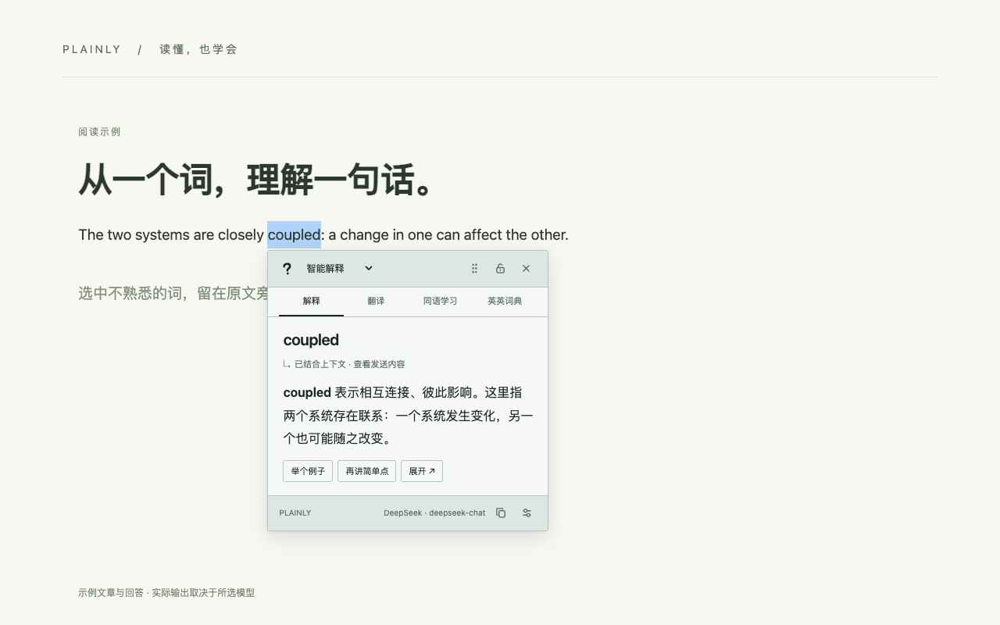
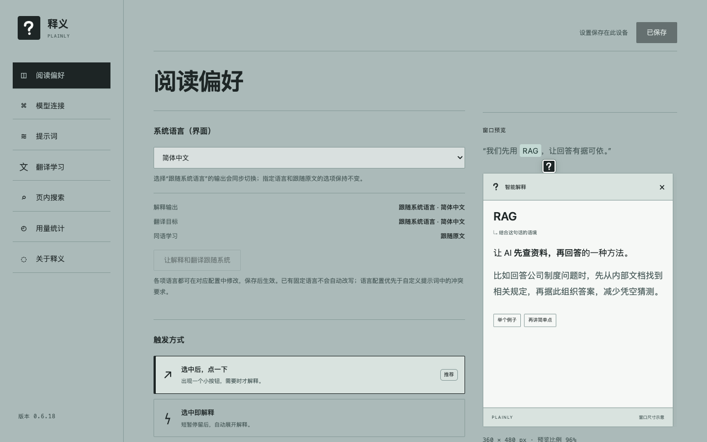

# 释义 · Plainly

[English](README.en.md) · [使用说明](docs/usage.zh-CN.md) · [下载扩展](https://github.com/JiaweiZhang1997/plainly/releases) · [反馈问题](https://github.com/JiaweiZhang1997/plainly/issues)

在网页中选中文字，用自己的 LLM API 解释术语、网络黑话和缩写，也可以翻译、同语学习或查询英英词典。Chrome / Edge Manifest V3 扩展，支持中文与英文界面。



## 安装：无需写代码

需要 **Chrome 或 Edge 128+**。

1. 打开 [Releases](https://github.com/JiaweiZhang1997/plainly/releases/latest)，下载 `plainly-<版本>-chrome-web-store.zip`，解压到一个长期保留的文件夹。
2. 打开 `chrome://extensions`（Edge 为 `edge://extensions`），启用“开发者模式”。
3. 点击“加载已解压的扩展程序”，选择解压后**直接包含 `manifest.json`** 的文件夹。
4. 固定工具栏里的“释义”，打开 **设置 → 模型连接**，选择服务商、填写自己的 API Key 和模型名称。测试连接后点击右上角“保存修改”。
5. 刷新已打开的普通网页，选中文字，点击旁边的问号。

发布包是本地加载用扩展包；项目尚未在 Chrome 应用商店正式上架。GitHub 自动提供的 `Source code` 是源码，需要按照下方步骤构建，不能直接作为扩展加载。

## 功能

- **解释**：智能解释、专业术语、黑话与梗、缩写、复杂表达；提示词可以修改。
- **翻译 / 同语学习**：双语翻译；用原文语言改写、讲词汇和语法，也可指定学习语言。
- **免费服务**：可选 MyMemory 翻译和 Free Dictionary API 英英词典，具体限制见[使用说明](docs/usage.zh-CN.md)。
- **多模型**：DeepSeek、OpenAI、Claude、Gemini、通义千问、GLM、Kimi、OpenRouter，以及兼容接口。预设模型是否可用取决于服务商账号，可自行修改。
- **Jev 语义检索**：用一句描述搜索网页正文；独立配置 API Key，支持按句、段落或自动切分。
- **PDF**：原生 PDF 阅读器选中文字后使用右键侧栏；内置 PDF.js 阅读器提供划词和全文检索。
- **可调整界面**：提示键四角位置、大小、自定义图片裁剪；窗口字号、宽高、拖动和锁定。
- **明确的语言规则**：界面与输出语言分开设置，可显式选择“跟随系统语言”；同语学习默认跟随原文。
- **本机用量**：累计服务商实际返回的 token 用量，不代表整个账户账单。

> OpenAI 预设目前使用 Chat Completions。Decisions API 入口尚未实现；未将普通聊天或结构化输出冒充该接口。



## 从源码构建

需要 **Node.js 24+**、npm。完整发布打包还需要 Python 3。

```bash
git clone https://github.com/JiaweiZhang1997/plainly.git
cd plainly
npm ci
npm run build
```

在扩展管理页加载项目的 `dist/` 文件夹。源码仓库不提交构建产物、个人头像、密钥、浏览器配置或历史工作文件。

```bash
npm run typecheck
npm test
```

浏览器检查使用 Playwright 和本地模拟 API，无需真实密钥：

```bash
npx playwright-core install chromium
npm run test:ui-localization
npm run test:card-drag
npm run test:icon-crop
npm run test:content-lifecycle
```

Linux 环境可用 `npx playwright-core install --with-deps chromium` 安装浏览器依赖。CI 使用 Node.js 24 运行类型、单元、构建和关键浏览器检查。

## 打包发布

```bash
npm run package:store
```

这会检查代码、构建公开分发版、用隔离浏览器生成中英文截图，并将产物放在项目内：

```text
releases/
  Plainly-<版本>-store/
    plainly-<版本>-chrome-web-store.zip
    index.html                  # 发布材料导航
    privacy.html                # 隐私说明
    images/                     # 商店截图
    SHA256.txt
  Plainly-<版本>-release-materials.zip
  Plainly-<版本>-upload-screenshots.zip  # 仅截图与上传说明
```

截图专用包分为 `zh-CN/`、`en/`、`global/`，每组 5 张 1280×800 JPEG。中文 / 英文组用于对应本地化区域，global 为英文兜底；每个上传框只选一组中的图片，不要混入图标、宣传图或 ZIP。打包时校验 JPEG 尺寸、三色彩通道及 PNG 的 24 位 RGB、无透明通道。

`npm run build:store` 仅构建 `store-dist/`，不发布任何远程内容。所有发布材料都在项目内；`releases/`、`dist/`、`store-dist/`、`work/`、`test-results/` 均不提交 Git。

## 隐私与限制

API Key 和偏好保存在此设备的扩展存储中，不同步到其他设备，也不是系统钥匙串。请求直接发往你配置的服务商，没有项目自建中转服务、广告或行为分析。使用模型会发送选中文字、按设置启用的上下文和追问；主动 Jev 搜索会发送检索描述与正文片段。上传图标与 PDF 文件在本机处理，使用模型时发送相关文字。

API 通常按服务商规则收费；同语学习的自动语言识别会额外请求一次模型。免费服务有自身限制和可用性约束。扫描 PDF 暂不支持 OCR。浏览器内部页、Chrome 商店和原生 PDF 阅读器不支持普通网页式注入；原生 PDF 请用右键侧栏。

详见[使用说明](docs/usage.zh-CN.md)、[隐私说明源码](public/privacy.html)及[安全反馈](SECURITY.md)。请勿在 Issue 或截图中公开 API Key。

## 参与开发与许可证

欢迎通过 Issue / Pull Request 提交问题与改进，见 [CONTRIBUTING.md](CONTRIBUTING.md)。项目代码采用 [MIT](LICENSE)；PDF.js、字体等依赖遵循各自许可证，见 [第三方声明](public/THIRD_PARTY_NOTICES.txt)。默认问号图标属于本项目；用户自行上传的图片不属于开源分发素材。
